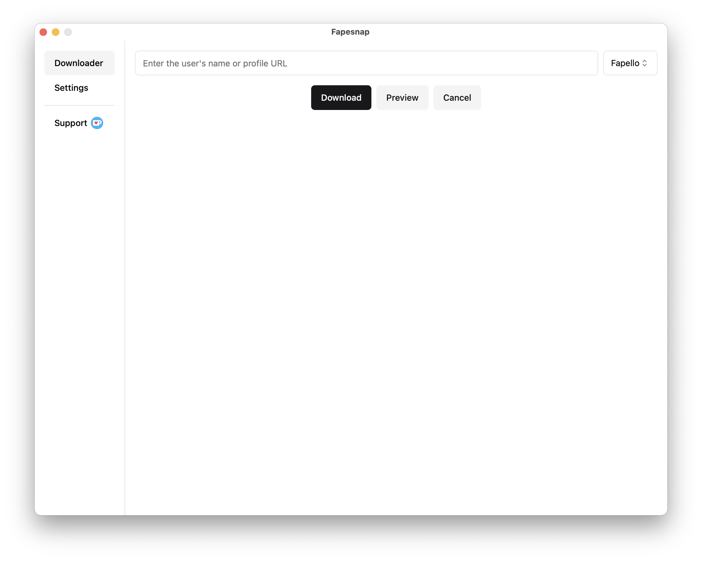
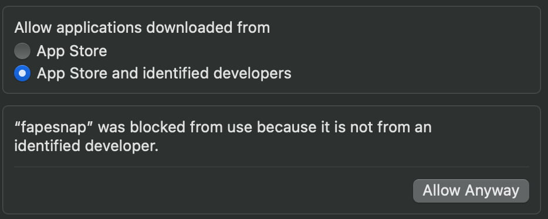

# Fapesnap - Nudes (most often) downloader

An app for downloading nudes from various sites.

Provider list

- Fapello
- Fapodrop
- Bunkr

## Usage

Open the app, enter a collection name such as username in Fapello or album ID for Bunkr, select the provider and choose to download the photos or view them first.

## Installation

All releases are in the "releases" section at this link - <https://github.com/nakrovati/fapesnap/releases>.

### Windows and Linux

Simply download the appropriate build for your OS and processor architecture from the releases page, and then invoke the program via CMD.

### MacOS

To use the program on macOS, you will need to manually allow the program to run through the settings.

> [!WARNING]
> Allowing execution of macOS programs from unreliable sources is potentially dangerous. If you are afraid to allow execution of this program, download it on Windows or Linux.

1. Open the system settings

2. Go to privacy settings

3. Allow the program to run

